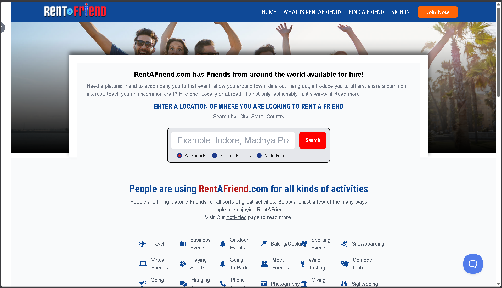
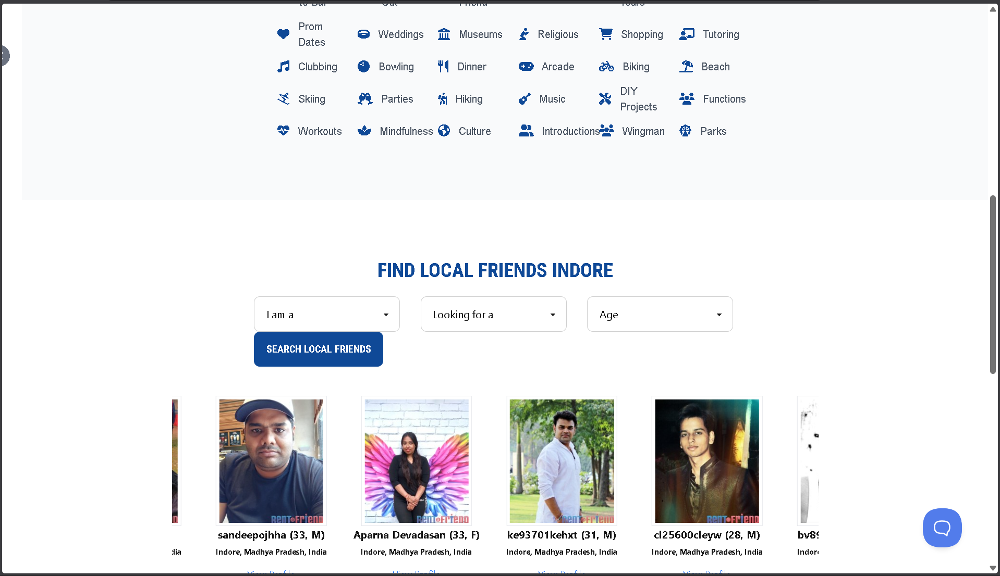
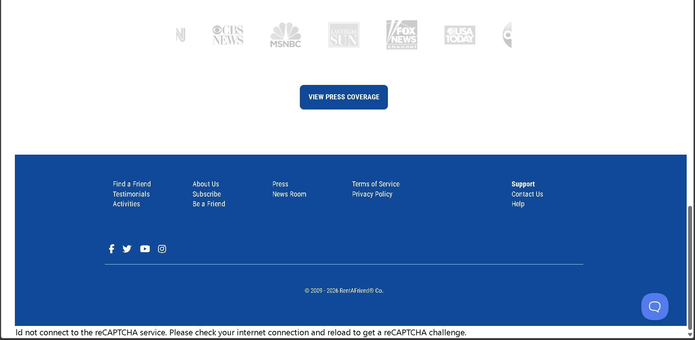
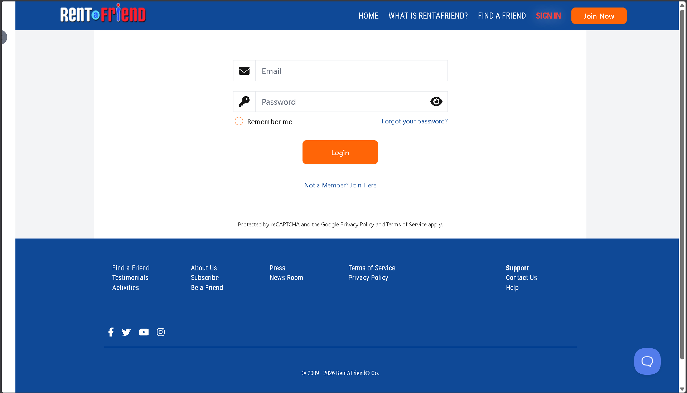
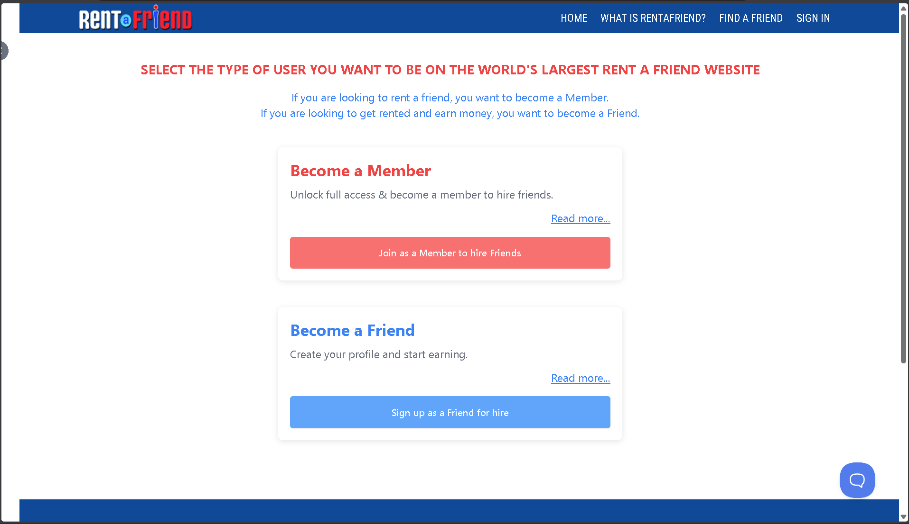

# Task 1 – Landing Page Redesign

Website chosen for redesign: **RentAFriend.com**

This task focuses on analyzing the existing landing page UI/UX and redesigning it for better clarity, usability, and modern appearance.

---

## Before – Existing Design

The following screenshots show the current design of the RentAFriend website before redesign.

---

## 🔹 Original Homepage

### Hero Section

### Scroll Section 1

### Scroll Section 2

---

## 🔹 Authentication Pages

### Sign In Page

### Join Page

---

## 🔹 Project Structure

- `screenshots/` → Original UI screenshots
- `wireframes/` → Low-fidelity redesign structure
- `final-design/` → Final UI redesign

---

## Screens Reviewed
- Home / Landing page (hero section)
- Scrolled homepage sections
- Sign in page
- Join / Become a Friend page

### Initial Observations
- The layout feels outdated and visually cluttered.
- Important actions (search, join, sign in) are not visually prioritized.
- Too much text in the hero section reduces clarity.
- Icons and spacing are inconsistent.
- The user flow for new users (join vs find a friend) is confusing.

---

## Goal of Redesign

To improve:
- Visual hierarchy
- Clarity of call-to-action
- Spacing and readability
- Overall modern UI appearance

The redesigned version will be added in the **final-design/** folder.

---

## 🛠 Tools Used

- Figma
- GitHub
